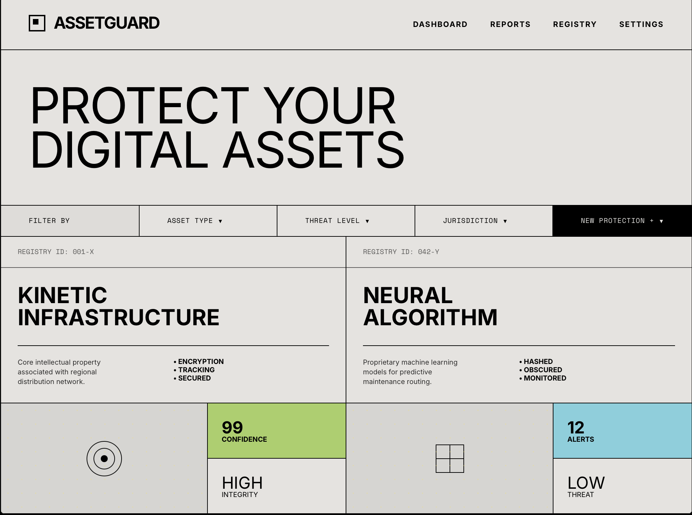
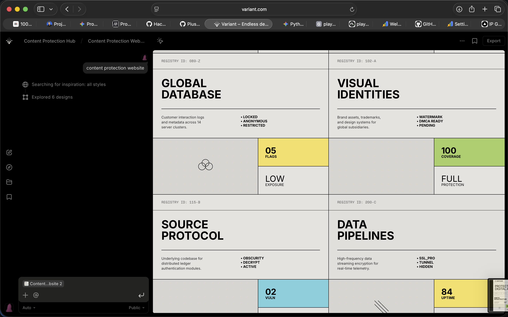
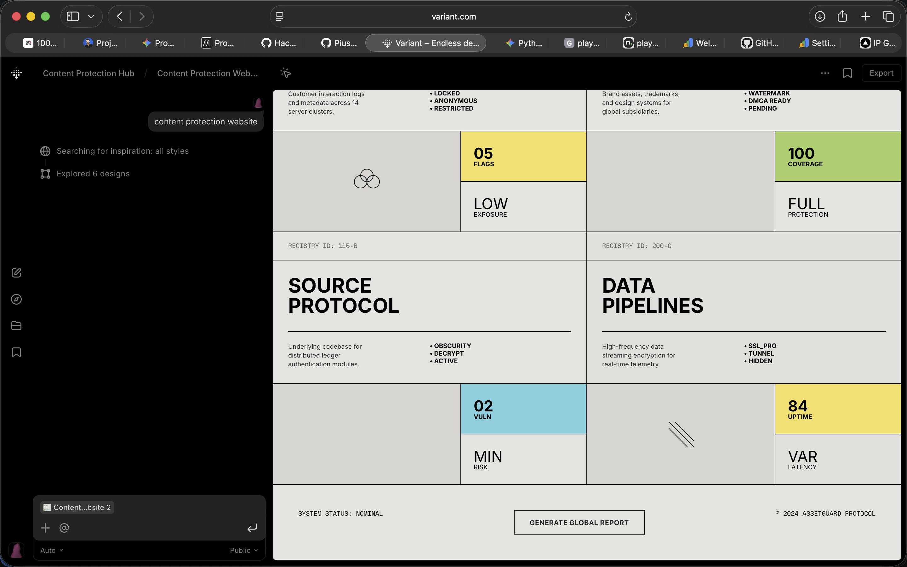

# 🛡️ PlayShield AI

> AI-powered, multi-tenant content protection platform that detects unauthorized reuse of protected image/video assets. Features full user onboarding, email verification, in-app notifications, automatic Vertex AI Gemini rationale generation, and auditable takedown drafting.

## Features

- **Full User Authentication:** Secure email/password signup, email verification, and password reset workflows.
- **Tenant Isolation:** Users can securely upload and manage their own assets; all data (assets, cases, detections, notifications, and audits) is strictly owner-scoped.
- **Automated Detection & Notifications:** AI-driven similarity matching (CLIP + FAISS + imagehash). When a violation is detected, the asset owner is immediately notified via in-app alerts and transaction emails.
- **Human-in-the-Loop Review:** Dedicated case management interface allowing users to review Gemini rationale, edit AI drafts, mark reviewed, and approve or reject potential violations.
- **Automatic Vertex AI Gemini Workflow:** Every new case requests a Gemini rationale plus takedown draft using full asset, evidence, confidence, risk, and discovery context, with deterministic fallback only when Gemini is unavailable.
- **Auditable Draft Revisioning:** Original AI drafts, user-edited revisions, draft review actions, exports, and Gemini call metadata are all stored and exposed for audit UI and API consumption.
- **Reference-Driven UI:** The authenticated dashboard, registry, and case detail routes now use bordered panels, soft AI callouts, accent tiles, and sticky action bars based on the supplied screenshot references.

## Architecture

```
┌──────────────────────────────────────────────────────────────┐
│                        Frontend (Next.js)                      │
│   Signup │ Login │ Dashboard │ Assets │ Cases │ Settings         │
└──────────────────────┬───────────────────────────────────────┘
                       │ REST API
┌──────────────────────┴───────────────────────────────────────┐
│                    Backend (FastAPI)                            │
│  Auth │ Assets │ Detection │ Cases │ Gemini │ Audit │ Notifications │
├───────────┬──────────┬──────────┬────────────────────────────┤
│ PostgreSQL│  Redis   │  FAISS   │  Google Cloud Storage       │
└───────────┴──────────┴──────────┴────────────────────────────┘
                       │ Celery Tasks
┌──────────────────────┴───────────────────────────────────────┐
│                    Worker (Celery)                              │
│  Playwright Crawler │ CV Pipeline │ FAISS Index Builder         │
└──────────────────────────────────────────────────────────────┘
```

## Quick Start (Local)

### Prerequisites
- Docker & Docker Compose
- Node.js 20+ (for frontend dev)
- Python 3.11+ (for backend dev)

### 1. Clone and Configure
```bash
cp .env.example .env
# Edit .env with your values (defaults work for local dev)
```

### 2. Start Everything
```bash
make dev
```

### 3. Run Migrations & Seed
```bash
make migrate
make seed
```

### 4. Access the App
- **Frontend:** http://localhost:3000
- **Backend API:** http://localhost:8000
- **API Docs:** http://localhost:8000/docs

### 5. Create an Account
Navigate to `http://localhost:3000/register` to create a new user account. Verify the email link (printed in the backend console if SMTP is unconfigured) to activate your account.

## API Endpoints

- `POST /auth/register` - Create user
- `POST /auth/verify-email` - Verify email token
- `POST /auth/login` - Get JWT tokens
- `POST /assets` - Upload user-scoped asset
- `GET /cases` - List user-scoped cases
- `GET /cases/{id}/gemini-summary` - Stored Gemini rationale, draft history, and recent AI call state
- `POST /cases/{id}/generate-gemini` - Refresh Gemini rationale + draft
- `PATCH /cases/{id}/drafts/{draftId}` - Save an edited takedown draft revision
- `POST /cases/{id}/drafts/{draftId}/review` - Mark a draft reviewed
- `POST /cases/{id}/generate-draft` - Backwards-compatible latest-draft generation endpoint
- `GET /notifications` - In-app alerts

## Gemini Workflow

1. A high-confidence detection creates a case.
2. The backend sends the full case context to Vertex AI Gemini.
3. The case stores:
   - Gemini rationale for the “Why This Match?” panel
   - Current Gemini/fallback state and user-facing incomplete/error messaging
   - Versioned takedown draft revisions
   - Gemini call metadata for auditability
4. Users can edit, review, copy, and export drafts without blocking core case actions.

## Design References

The implemented UI tracks the screenshot references copied into `docs/references/`.





## Verification

- `python3 -m compileall backend/app backend/tests`
- `npm run lint`
- `npx next build --webpack`

## GCP Deployment

### Manual Deploy
```bash
export GCP_PROJECT_ID=your-project-id
./infra/deploy-full.sh
```

### CI/CD (GitHub Actions)
Push to `main` branch triggers automatic deployment via `.github/workflows/deploy.yml`.

Required GitHub Secrets:
- `GCP_PROJECT_ID`
- `WIF_PROVIDER` (Workload Identity Federation)
- `WIF_SERVICE_ACCOUNT`

## License
Proprietary — All rights reserved.
